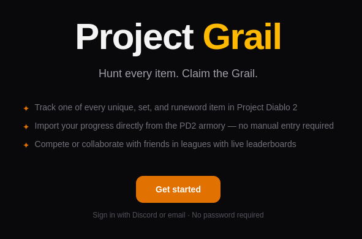

# Project Grail

A Holy Grail challenge tracker for **[Project Diablo 2](https://projectdiablo2.com/)** — the community mod for Diablo II: Lord of Destruction.

🌐 **Live at [pd2grail.com](https://pd2grail.com)**



Track every unique, set item, runeword, and rune across the current season. Import directly from your characters' armory pages, run cooperative or competitive leagues with friends, get Discord notifications when a member finds something rare, and share your progress with a public profile URL.

---

## Features

- 🛡️ **Solo grail tracking** — checklist UI for every PD2 item in the current season
- ⚔️ **Armory import** — pull found items straight from the PD2 armory and shared stash, with a diff/confirm step before any writes
- 👥 **Leagues** — three flavors (competitive, hybrid, cooperative) with leaderboards, missing-items views, team grails, and an activity feed
- 🤖 **Discord webhooks** — batched item-find notifications with item images, milestone callouts, and achievement unlocks
- 🏆 **Achievements** — milestones for item counts, percentage progress, first runes / runewords / set pieces, and full set completions
- 🌐 **Public profiles** at `/grail/<username>` (with an opt-out toggle) and shareable league URLs
- 👑 **League commissioner tools** — transfer ownership, manage members, configure grail scope and Discord webhook

See [`docs/screenshots/`](docs/screenshots/) for a tour of the UI.

---

## Stack

| Layer | Choice |
|---|---|
| Framework | Next.js 16 (App Router) |
| Language | TypeScript |
| Styling | Tailwind CSS |
| Database | PostgreSQL via Prisma 7 (`@prisma/adapter-pg`) |
| Auth | NextAuth.js v5 — Discord OAuth (primary) + Resend magic-link (fallback) |
| Email | Resend |
| Error monitoring | Sentry (optional) |
| Hosting (reference) | Vercel (app) + Railway (Postgres) |
| Cron | GitHub Actions (`.github/workflows/discord-flush.yml`) hitting `/api/cron/discord-flush` every 5 minutes |

No Vercel-proprietary infra is required — the code is portable to any Node 20+ host. See [`docs/PROJECT.md`](docs/PROJECT.md) for architectural details.

---

## Local development

### Prerequisites

- Node.js 20+
- A Postgres database (local Docker, Supabase, Neon, Railway — anything that speaks Postgres)
- A Discord application for OAuth (free, at [discord.com/developers](https://discord.com/developers/applications))
- A Resend account for magic-link email (free tier is generous)

### Setup

```bash
git clone https://github.com/postblink/project-grail.git
cd project-grail
npm install

# Configure env vars
cp .env.example .env
# Then fill in DATABASE_URL, DISCORD_CLIENT_ID/SECRET, RESEND_API_KEY, etc.
# See .env.example for the full list with comments.

# Apply schema
npx prisma migrate deploy

# Seed the item database (PD2 wiki snapshot)
npx prisma db seed

# Run
npm run dev
```

Open [http://localhost:3000](http://localhost:3000).

### Refreshing item data

Each PD2 season may add or rework items. Pull a fresh snapshot from the wiki:

```bash
npx tsx scripts/scrape-items.ts          # writes prisma/seed-data/items.json
npx prisma db seed                       # upserts into the DB
```

The admin panel (`/admin/items`) also accepts JSON imports from the same shape.

---

## Deployment

The reference deployment is Vercel + Railway, but anything that runs Next.js and Postgres works.

### Discord-batch flush cron

Item-find notifications are batched so users with rapid finds don't spam channels. A cron must call `/api/cron/discord-flush` every few minutes to flush queued batches. Two options:

1. **GitHub Actions** (included): `.github/workflows/discord-flush.yml` runs every 5 minutes. Requires repo secrets `APP_URL` and `CRON_SECRET`. **Free on public repos; counts against the 2,000-min/month limit on private free-tier repos.**
2. **Vercel Cron**: add a `crons` entry to `vercel.ts`. Free, but limited to 2 jobs on the Hobby plan.

### Required env vars in production

The full list is in [`.env.example`](.env.example). At minimum: `DATABASE_URL`, `NEXTAUTH_URL` + `AUTH_URL`, `NEXTAUTH_SECRET`, `DISCORD_CLIENT_ID` + `DISCORD_CLIENT_SECRET`, `RESEND_API_KEY`, `EMAIL_FROM`, `CRON_SECRET`.

---

## ⚠️ Destructive scripts

`scripts/reset-user-data.ts` **deletes all user-generated data** (users, grails, grail entries, leagues, members, achievements, Discord batches) while preserving items and seasons. It exists for pre-launch resets — **do not run against a production database that has real users on it.**

```bash
# Run only against a dev/staging database you can afford to wipe:
npx tsx --tsconfig tsconfig.scripts.json scripts/reset-user-data.ts
```

The script reads `DATABASE_URL` from `.env`. Always double-check which database that variable points at before running.

---

## Documentation

- [`docs/PROJECT.md`](docs/PROJECT.md) — project conventions, architecture, domain context, code style
- [`DESIGN.md`](DESIGN.md) — product spec and intended behavior (source of truth for ambiguous cases)
- [`docs/screenshots/`](docs/screenshots/) — UI screenshots

---

## Contributing

Contributions welcome — bug reports, feature ideas, and PRs all good. Before opening a PR:

1. Read `docs/PROJECT.md` for code conventions
2. Make sure `npx tsc --noEmit` is clean
3. Keep schema changes accompanied by a Prisma migration

For larger features, open an issue first to discuss the approach.

---

## What this project is not

- ❌ Not affiliated with Blizzard or the Project Diablo 2 team
- ❌ Does not interact with the PD2 trade site (scraping or querying it can get players banned)
- ❌ Does not poll the armory automatically — all imports are user-initiated
- ❌ Not a vanilla LoD or D2R grail tracker. The item DB is PD2-specific and changes per season.

---

## License

Project Grail is free software, licensed under the **GNU Affero General Public License v3.0**. See [LICENSE](LICENSE) for the full text.

```
Copyright (C) 2026 Lucas Boyles

This program is free software: you can redistribute it and/or modify it under
the terms of the GNU Affero General Public License as published by the Free
Software Foundation, version 3 of the License.

This program is distributed in the hope that it will be useful, but WITHOUT
ANY WARRANTY; without even the implied warranty of MERCHANTABILITY or FITNESS
FOR A PARTICULAR PURPOSE. See the GNU Affero General Public License for more
details.
```

**What AGPL means for you:**
- ✅ Use it, fork it, modify it, redistribute it — all fine
- ✅ Run a private modified version internally — fine
- ⚠️ **Run a modified version as a public service** — you must publish your source under the same license

This is intentional: the goal is to keep modifications to a community grail tracker available to that community.
